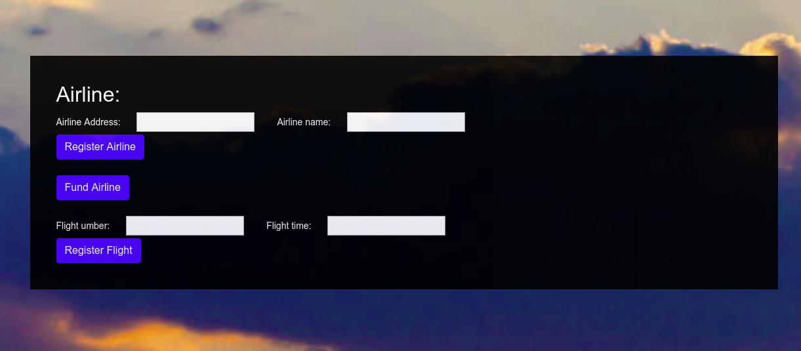
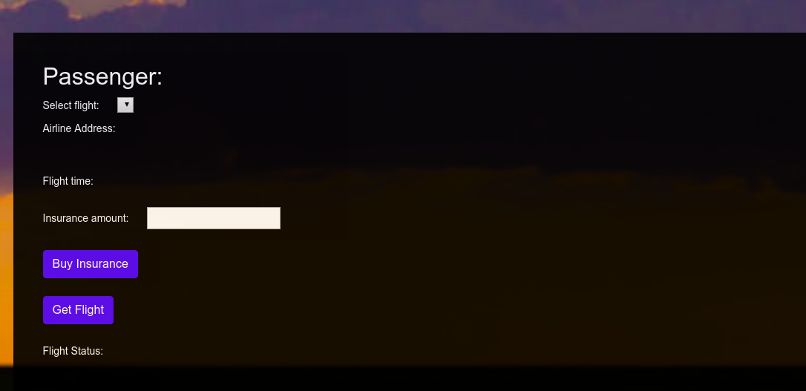
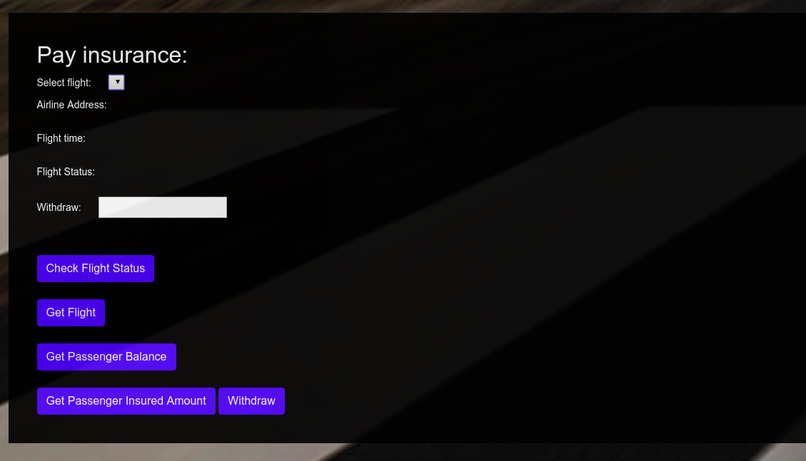

# Introduction

This repository contains a dapp of flight surety, which is running on Ethereum platform. This is test on the Ganache GUI. 

## Install
To install, download or clone the repo, then:

`npm install`
`truffle compile`
`truffle migrate`

To test
`truffle test test/dataTest.js`

Note that you should change the address of `firstAirline` in `migrations/2_deploy_contracts.js` before truffle migrate and test.

## Client

To use the dapp:
`npm run dapp`

To view dapp:
`http://localhost:8000`

## Develop Server

`npm run server`

## Deploy

To build dapp for prod:
`npm run dapp:prod`

Deploy the contents of the ./dapp folder

## Version 
```
Truffle v5.0.18 (core: 5.0.18)
Solidity - ^0.4.25 (solc-js)
Node v10.15.1
```

## Demo


